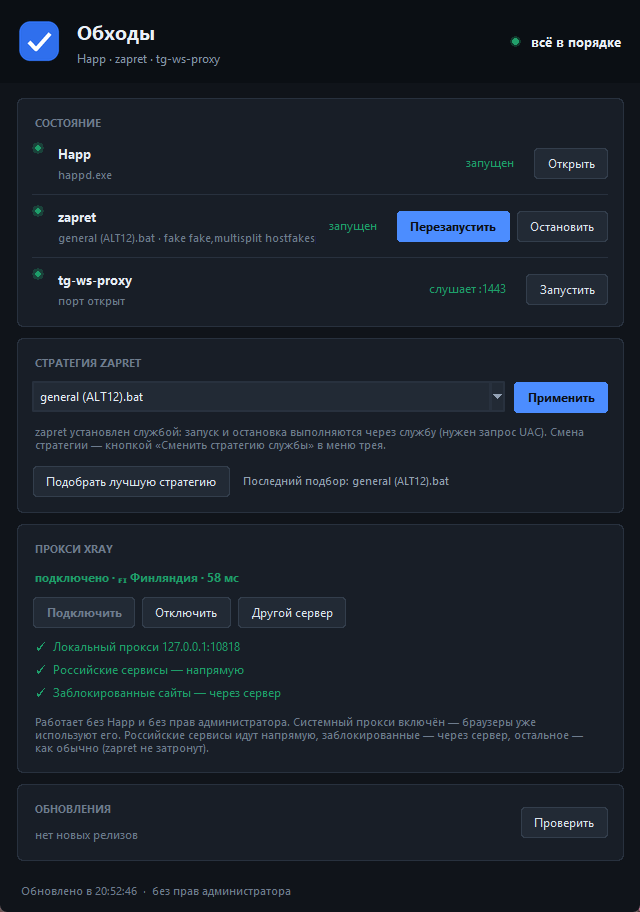

# bypass-tray

Windows-трей-приложение, которое собирает в одном месте состояние всех «обходов»
на ПК, позволяет управлять ими и оповещает об обновлениях:

- **Happ** — VPN-клиент (Xray), работает не всегда; через него должны идти только
  заблокированные в РФ сервисы и западные соцсети;
- **zapret** (`general (ALT).bat`, `winws.exe`) — обход DPI для YouTube и Discord
  (они должны идти **напрямую**, не через VPN);
- **tg-ws-proxy** — локальный MTProto-прокси для Telegram Desktop (работает всегда).

Иконка в трее меняется по состоянию (Happ выключен / zapret не запущен /
tg-ws-proxy не работает / всё ок / есть обновления). По клику — панель со
статусами и кнопками; в меню — быстрые действия и выбор стратегии zapret.



> Это Windows-аналог Linux-виджета «Обходы» из проекта
> `VPN-TGWSProxy-Zapret-orchestrate`. Бэкенд другой: на Windows нет nfqws,
> systemd и т.п.

## Возможности

- **Собственный клиент Xray** (Happ не нужен): берёт серверы из вашей
  подписки, проверяет доступность, выбирает самый быстрый и поднимает
  локальный прокси на `127.0.0.1:10818`. **Права администратора не нужны**,
  TUN не используется, `zapret` продолжает работать как обычно. Российские
  сервисы идут напрямую, заблокированные — через сервер; прокси прописывается
  в систему, поэтому браузеры начинают им пользоваться сразу.
- **Выбор сервера и автопереподключение**: список живых серверов с задержками
  прямо в панели — можно поставить любой вручную. Раз в ~30 секунд туннель
  проверяется настоящим запросом через сервер; если сервер перестал отвечать,
  приложение само переключается на следующий по скорости.
- **Статусы**: Happ, `winws.exe`, порт `tg-ws-proxy`, доступные обновления.
- **Автоподбор стратегии zapret**: перебирает все `general*.bat`, реально
  проверяет YouTube/Discord и ставит в службу лучшую стратегию (один запрос
  UAC). Команда `winws` берётся из самого `.bat`, поэтому воспроизводится
  точно.
- **Определение стратегии**: какой именно `general*.bat` сейчас работает —
  по отпечатку опций `--dpi-desync*`. Читается даже когда zapret установлен
  **службой** и командная строка процесса недоступна без прав администратора
  (аргументы берутся из реестра).
- **Панель**: карточки состояний, управление, выбор стратегии, туннелирование,
  автоподбор; светлая и тёмная тема (по системной).
- **Управление zapret**: служба (`sc stop/start`, при необходимости через UAC)
  или `.bat` для портативной установки; окна консоли подавляются.
- **Обновления**: GitHub-релизы zapret и tg-ws-proxy + запасное оповещение,
  если системные уведомления подавлены.

## Установка

Требуется Python 3.10+ (при установке отметьте «Add Python to PATH»).

1. Скачайте репозиторий и распакуйте.
2. Запустите **`setup.bat`** — один раз, больше ничего не нужно.

`setup.bat` создаст окружение, поставит зависимости, **скачает zapret и
tg-ws-proxy из официальных релизов**, включит автозапуск и запустит виджет
в трее. Останется открыть «Настройки» и вставить ссылку на подписку VPN.

Дальше приложение стартует само при входе в систему (`run.bat` в автозапуске).

### Где что лежит

| Что | Куда |
|---|---|
| Приложение | папка, куда распакован репозиторий |
| zapret | `%LOCALAPPDATA%\bypass-tray\zapret` |
| tg-ws-proxy | `%LOCALAPPDATA%\bypass-tray\tgws` |
| Ядро Xray | `<проект>\bin` (копируется из Happ при первом запуске) |
| Настройки | `%APPDATA%\bypass-tray\config.json` |

## Настройки

Кнопка **«Настройки»** в шапке панели (или пункт в меню трея):

- **ссылка на подписку VPN** — то, что выдаёт провайдер; хранится только
  локально, в репозиторий не попадает;
- порт локального прокси и системный прокси;
- резервный режим для YouTube/Discord;
- свои сайты через VPN (`domain:имя`, `geosite:набор`);
- **«Установить обходы»** — скачивает zapret и tg-ws-proxy, не выходя из окна;
- пути к zapret и tg-ws-proxy (заполняются автоматически).

## Проверка

```bat
.venv\Scripts\python.exe tests\smoke_test.py
```

Скрипт проверяет пути, схему статусов, определение стратегии, иконки, меню,
отрисовку панели, жизненный цикл окна и доступность GitHub. Обход при этом
не останавливается и не запускается.

## Настройка

При первом запуске создаётся `%APPDATA%\bypass-tray\config.json`; пути
(`zapret_dir`, `tgws_exe`, `happ_exe`) определяются автоматически по типовым
местам, но их можно вписать вручную. Полное описание — [docs/CONFIG.md](docs/CONFIG.md).

## Документация

- [docs/SPEC.md](docs/SPEC.md) — полное функциональное описание (для агента:
  что должно получиться, критерии приёмки, роадмап).
- [docs/ARCHITECTURE.md](docs/ARCHITECTURE.md) — модули, схема данных, API статусов.
- [docs/HAPP-ROUTING.md](docs/HAPP-ROUTING.md) — предлагаемая схема
  сплит-туннеля Happ (YouTube/Discord — напрямую под zapret, западные соцсети — в VPN).
- [docs/CONFIG.md](docs/CONFIG.md) — конфиг и пути.

## Статус

Развёрнуто и проверено на текущей машине. Открытым остаётся сплит-туннель
Happ — [docs/HAPP-ROUTING.md](docs/HAPP-ROUTING.md); задачи — в конце
[docs/SPEC.md](docs/SPEC.md).

### Развёртывание на этой машине

| Что | Значение |
|---|---|
| Проект | `F:\Plugins\bypass-tray` |
| Проверка статусов | `.venv\Scripts\python.exe -m bypass_tray --status` |
| Проверки | `.venv\Scripts\python.exe tests\smoke_test.py` |
| Запуск | `run.bat` (или ярлык в `shell:startup`) |
| zapret | `C:\Program Files\Zapret` — **служба** `zapret` |
| Happ | `C:\Program Files\FlyFrogLLC\Happ\Happ.exe` |
| tg-ws-proxy | `C:\Users\Egor Egorov\Desktop\TgWsProxy_windows.exe` |
| Автозапуск | ярлык `bypass-tray.lnk` в папке `shell:startup` |

Подробности и особенности службы zapret — в [docs/CONFIG.md](docs/CONFIG.md).

### Что требует прав администратора

Приложение работает и без прав администратора, но управление **службой**
zapret (`sc stop/start`, смена стратегии) требует UAC: при нажатии кнопки
появится системный запрос. Если запрос отклонить, статусы продолжат
обновляться, а действие просто не выполнится.

## Лицензия

MIT (см. [LICENSE](LICENSE)).
